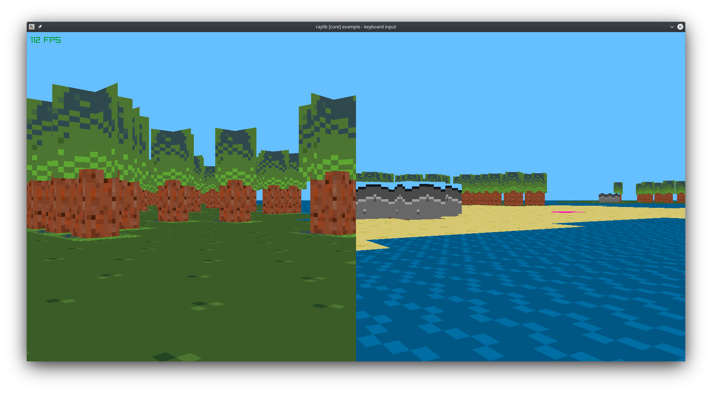

# minicraft_3D

## TODO:
- [X] Render World from Minicraft 3DS port in 2D
- [X] Render World in 3D
- [X] Render Trees
- [ ] Create Data structure to hold tile_info, height, collision properties, floor or objects
- [ ] Create chunking/viewport system to avoid drawing parts of world that are not visible
- [ ] Create generic UI Menu system for tutorial, crafting, inventory
- [ ] Port game features from original game to here

